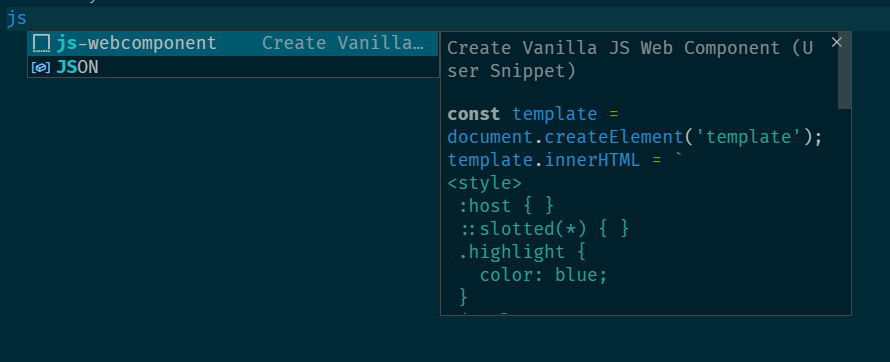

# Vanilla JavaScript Web Component

This extension is to create ES6 Class based Vanilla JavaScript Web Component along with Shadow DOM setup, CSS selectors for slot and host elements.

## Features

## Requirements

In order to use this code snippet, there are no dependencies required. But to build vanilla javascript web component we need to have `@webcomponents/webcomponentsjs` package pre-installed.

## Release Notes

### 1.0.0

Initial release of having code snippet to develop ES6 Class based web component.
